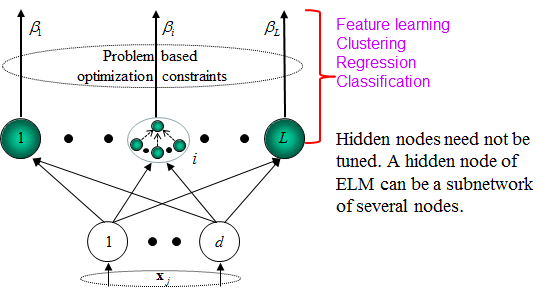
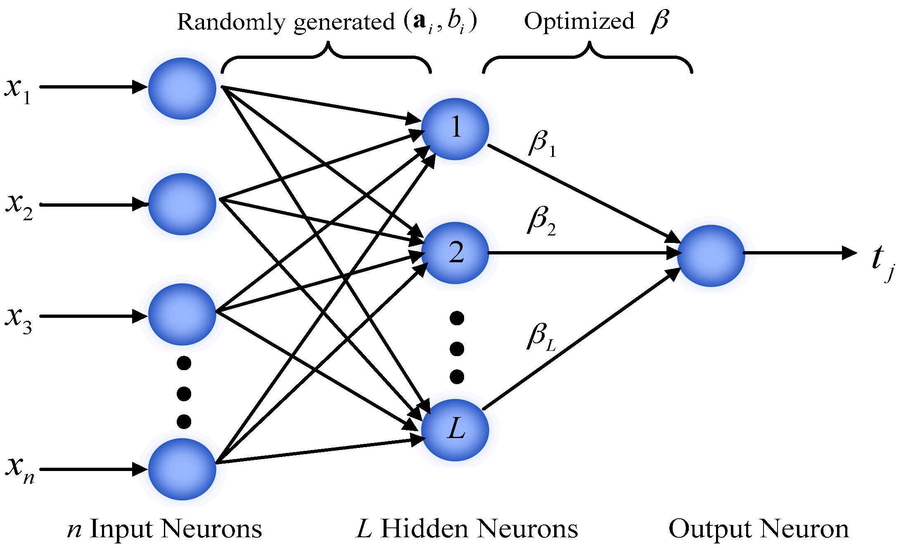

# A Comparative Study of Metaheuristic-based Extreme Learning Machine For Streamflow Modeling

# Links:
1. Code
    https://github.com/aiir-team/math-MHA-ELM-streamflow-code
2. Paper:
    https://github.com/aiir-team/math-MHA-ELM-streamflow-paper


```code 

## Models
# Evolutionary-based
{"name": "GA-ELM", "class": "GaElm", "param_grid": ga_paras},  # Genetic Algorithm (GA)
A New Workload Prediction Model Using Extreme Learning Machine and Enhanced Tug of War optimization

{"name": "CRO-ELM", "class": "CroElm", "param_grid": cro_paras},  # Coral Reefs Optimization (CRO)
Daily global solar radiation prediction based on a hybrid Coral Reefs Optimization–Extreme Learning Machine approach

## Swarm-based
{"name": "AGTO-ELM", "class": "AgtoElm", "param_grid": agto_paras},  # Artificial Gorilla Troops Optimization (AGTO)
Bearing Fault Diagnosis Using Extreme Learning Machine Based on Artificial Gorilla Troops Optimizer

{"name": "ARO-ELM", "class": "AroElm", "param_grid": aro_paras},  # Artificial Rabbits Optimization (ARO)
An Efficient Model for Sentiment Analysis using Artificial Rabbits Optimized Vector Functional Link Network

{"name": "AVOA-ELM", "class": "AvoaElm", "param_grid": aro_paras},  # African Vultures Optimization Algorithm (AVOA)
A novel three-stage hybrid learning paradigm based on a multi-decomposition strategy, optimized relevance vector machine, and error correction for multi-step forecasting of precious metal prices

{"name": "DMOA-ELM", "class": "DmoaElm", "param_grid": dmoa_paras},  # Dwarf Mongoose Optimization Algorithm (DMOA)

{"name": "HGS-ELM", "class": "HgsElm", "param_grid": hgs_paras},  # Hunger Games Search (HGS)
Underwater Backscatter Recognition Using Deep Fuzzy Extreme Convolutional Neural Network Optimized via Hunger Games Search

{"name": "SSA-ELM", "class": "SsaElm", "param_grid": ssa_paras},  # Sparrow Search Algorithm (SSA)
Research on diagnosis method of series arc fault of three-phase load based on SSA-ELM

{"name": "WOA-ELM", "class": "WoaElm", "param_grid": woa_paras},  # Whale Optimization Algorithm (WOA)
Extreme learning machine optimized by whale optimization algorithm using insulated gate bipolar transistor module aging degree evaluation

# ## Physics-based
{"name": "NRO-ELM", "class": "NroElm", "param_grid": nro_paras},  # Nuclear Reaction Optimization (NRO)
A comprehensive comparison of recent developed meta-heuristic algorithms for streamflow time series forecasting problem

{"name": "HGSO-ELM", "class": "HgsoElm", "param_grid": hgso_paras},  # Henry Gas Solubility Optimization (HGSO)
Extreme learning machine evolved by fuzzified hunger games search for energy and individual thermal comfort optimization

{"name": "ASO-ELM", "class": "AsoElm", "param_grid": aso_paras},  # Atom Search Optimization (ASO)
Integrated framework of extreme learning machine (ELM) based on improved atom search optimization for short-term wind speed prediction

{"name": "ArchOA-ELM", "class": "ArchoaElm", "param_grid": archoa_paras},  # Archimedes Optimization Algorithm (ArchOA)


# # Human-based added
{"name": "CHIO-ELM", "class": "ChioElm", "param_grid": chio_paras},  # Coronavirus Herd Immunity Optimization (CHIO)

{"name": "LCO-ELM", "class": "LcoElm", "param_grid": lco_paras},  # Life Choice-based Optimization (LCO)
An Improved Sea Lion Optimization for Workload Elasticity Prediction with Neural Networks

{"name": "TLO-ELM", "class": "TloElm", "param_grid": tlo_paras},  # Teaching Learning-based Optimization (TLO)
Comparison of modified teaching–learning-based optimization and extreme learning machine for classification of multiple power signal disturbances

# ## Bio-based
{"name": "SMA-ELM", "class": "SmaElm", "param_grid": sma_paras},  # Slime Mould Algorithm (SMA)
{"name": "SOA-ELM", "class": "SoaElm", "param_grid": soa_paras},  # Seagull Optimization Algorithm (SOA)

{"name": "TSA-ELM", "class": "TsaElm", "param_grid": tsa_paras},  # Tunicate Swarm Algorithm (TSA)
Short‐term commercial load forecasting based on peak‐valley features with the TSA‐ELM model

# ## Music-based group
{"name": "HS-ELM", "class": "HsElm", "param_grid": hs_paras},  # Harmony Search (HS)
A hybrid intelligent model for medium-term sales forecasting in fashion retail supply chains using extreme learning machine and harmony search algorithm


# ## System-based
{"name": "AEO-ELM", "class": "AeoElm", "param_grid": aeo_paras},  # Artificial Ecosystem-based Optimization (AEO)

# ## Math-based
{"name": "GBO-ELM", "class": "GboElm", "param_grid": gbo_paras},  # Gradient-Based Optimizer (GBO)
Extreme Learning Machine Using Improved Gradient-Based Optimizer for Dam Seepage Prediction

{"name": "PSS-ELM", "class": "PssElm", "param_grid": pss_paras},  # Pareto-like Sequential Sampling (PSS)

{"name": "INFO-ELM", "class": "InfoElm", "param_grid": info_paras},  # weIghted meaN oF vectOrs (INFO)

{"name": "RUN-ELM", "class": "RunElm", "param_grid": run_paras},  # RUNge Kutta optimizer (RUN)
```


## How to run code
1. Run model: script_normal_mha_elm.py
4. Get the results table mean, std, cv by: get_table_results.py
5. Results saved in folder: history/results/
 
 
## Environment

1. If using conda or miniconda 
```code 
conda create -n new ml python==3.8.5
conda activate ml

pip install numpy, pandas, scikit-learn, matplotlib, seaborn, h5py
pip install xlsxwriter==3.0.3, openpyxl==3.0.9
pip install tensorflow==2.9.1
pip install keras==2.9.0
pip install permetrics==1.3.2
pip install mealpy==2.5.1
```

2. If using pip

2.1 On Windows

```code 
open terminal: (pip on windows is already installed inside python)
   python -m venv ml
   ml\Scripts\activate.bat
   pip install -r requirements.txt
   
Or using Pycharm, setting for this environment and install packages in pycharm terminal
```

2.2 On linux/ubuntu

```code 
sudo apt-get install pip3
sudo apt-get install python3.8-venv

python3 -m venv ml 
source ml/bin/activate
pip install -r requirements.txt
```


## MHA-ELM

- ELM: Extreme Learning Machine

- Mô hình này ban đầu cũng là mạng cải tiến của mô hình MLP. Có thể có 1 hoặc nhiều tầng ẩn. Tuy nhiên với 1 tầng ẩn là
  quá đủ để mapping tất cả các thể loại hàm yêu cầu.
- Cơ chế và sự khác biệt giữa MLP và ELM chỉ là cách huấn luyện mạng nơ-ron như sau:

    + Weights giữa tầng input và tầng hidden được random ngẫu nhiên, và sẽ không thay đổi.
    + Wegiths giữa tầng hidden và tầng output theo MLP chính thống sẽ là được tính mà cách nhân ma trận. Vì khi đã biết
      được giá trị thực tế, labels y. Thì chỉ cần nhân ma trận là tìm ra weights. Đặc biệt với cách này có thể tìm chính
      xác được điểm global optimal. Tuy nhiên vấn đề là nó chỉ là global optimal cho cái bộ random weight bên trên. Với
      bộ random weight khác nó lại là global optimal khác.

- Ưu điểm của ELM:

    + Fast, cực kì nhanh, không dùng gradient descent để train mạng. Không có epochs/generations --> Train bộ dữ liệu
      cực kì lớn cũng chỉ vài giây vì nó thực chất chỉ là nhân ma trận thôi.
    + Hiệu quả cao vì nhân ma trận để tính được global optimal, nhưng cần phải xét số lượng hidden unit lớn, như vậy mới
      học được dữ liệu lớn. Ví dụ: 1 triệu data --> 100000 hidden size chẳng hạn. Thì kết quả mới tốt.

- Nhược điểm của ELM:

    + Như đã giải thích bên trên, nhân ma trận chỉ tìm ra được global optimal cho bộ random weight đó. Vậy nếu bộ random
      weight nó xấu, thì global optimal tìm được chưa chắc đã là global optimal cho toàn bài toán.

- Cải tiến ELM dùng Metaheuristics:

    + Dùng Metaheuristics để tạo ra 1 quẩn thể (tập) các solution. Mỗi solution là 1 bộ random weight giữa tầng input và
      tầng hidden. Còn weights giữa tầng hidden và tầng output ta vẫn dùng nhân ma trận như thường.
    + Vậy có thể thấy, Metaheuristics giúp mạng ELM xét qua nhiều bộ random weight hơn --> Chăc chắn sẽ tốt hơn ELM
      thường.
    + Đặc điểm nữa là: Khi dùng Metaheuristics, ta không cần thiết lập số hidden size lớn, vì ta đã duyệt qua nhiều khả
      năng, nên chỉ cần set nhỏ như mạng bình thường là được.

    + Nhược điểm của cải tiến này là: Thời gian huấn luyện sẽ lâu hơn ELM thường, vì metaheuristics cũng sử dụng
      epochs/generations y như neural network vậy.

- Một số cách cải tiến khác của ELM:

    + Một số bài báo dùng Kernel ELM, tức là thay thế việc random weight của tầng input và tầng hidden bằng các kĩ thuật
      khác ví dụ kĩ thuật tính khoảng cách từ mạng Radial Basic Function Network. Còn weights giữa tầng hidden và tầng
      output:
        + Nếu sử dụng Gradient Descent thì nó sẽ trở thành mạng Radial Basic Function Network.
        + Nếu sử dụng nhân ma trận như ELM thường thì là 1 biến thể của ELM và có thể sẽ tốt hơn.


- Lý thuyết là vậy. Ta đi chứng mình bằng thực nghiệm.






## Notes

https://stackoverflow.com/questions/2186525/how-to-use-glob-to-find-files-recursively
https://stackoverflow.com/questions/14509192/how-to-import-functions-from-other-projects-in-python
https://stackoverflow.com/questions/51520/how-to-get-an-absolute-file-path-in-python
https://stackoverflow.com/questions/14132789/relative-imports-for-the-billionth-time


https://datatofish.com/read_excel/

https://pythontic.com/modules/pickle/dumps
https://medium.com/fintechexplained/how-to-save-trained-machine-learning-models-649c3ad1c018
https://github.com/keras-team/keras/issues/14180
https://ai-pool.com/d/how-to-get-the-weights-of-keras-model-

```python 
https://stackoverflow.com/questions/1894269/how-to-convert-string-representation-of-list-to-a-list

import json 
x = "[0.7587068025868327, 1000.0, 125.3177189672638, 150, 1.0, 4, 0.1, 10.0]"
solution = json.loads(x)
print(solution)

```
